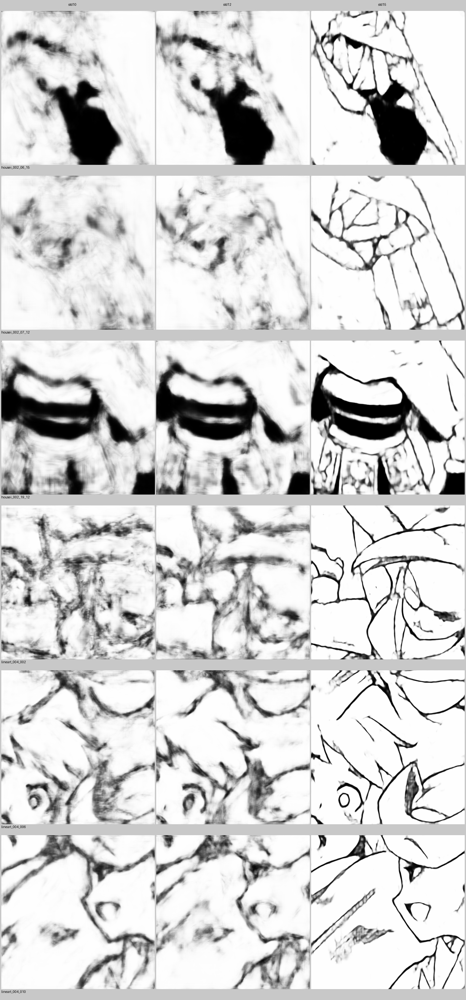

# Lineart Generator

ラフ画像（手書きスケッチ）から線画を生成する深層学習プロジェクト。


*左から std>=10 / std>=12 / std>=15 で学習したモデルの出力比較*

---

## 概要

UNet ベースのモデルでラフ画像を線画に変換します。  
Canny エッジ損失（`losses.py`）と BCE+L1 損失を組み合わせ、細かい線質を保った出力を目指します。

**採用モデル:** データ品質フィルタリング（autocontrast後 std>=15）で厳選した 660 枚で学習した `checkpoints/std15/best.pth`（loss=0.1705）

---

## 環境

- Ubuntu 22.04
- RTX 3060 (12GB) / CUDA 12.8
- Python 3.10

```bash
pip install torch torchvision pillow opencv-python
```

---

## データセット構成

```
dataset_480/
  train/
    rough/   # ラフ画像（入力）
    line/    # 線画画像（正解）
  test/
    rough/
    line/
  valid_train_std15.txt  # 品質フィルタ済みファイルリスト（660枚）
```

**品質フィルタリングの知見:**  
housei 系のラフは全体的に薄く（std 3〜6）、autocontrast 後の std>=15 が実用ラインと判明。  
`data_check.py` で各ファイルの std を確認できます。

---

## 学習

```bash
python train.py \
  --file-list dataset_480/valid_train_std15.txt \
  --checkpoint-dir checkpoints/std15 \
  --autocontrast
```

**主なオプション:**

| オプション | デフォルト | 説明 |
|---|---|---|
| `--file-list` | `dataset_480/valid_train.txt` | 学習ファイルリスト |
| `--checkpoint-dir` | `checkpoints/base` | チェックポイント保存先 |
| `--resume` | なし | 途中再開するチェックポイントパス |
| `--autocontrast` / `--no-autocontrast` | True | rough に autocontrast を適用 |

チェックポイントは 10 epoch ごとと best loss 更新時に保存されます。

---

## 推論

```bash
python inference.py \
  --checkpoint checkpoints/std15/best.pth \
  --input path/to/rough.jpg \
  --output results/output.png \
  --autocontrast
```

---

## 実験結果

| 条件 | 学習枚数 | best loss | 評価 |
|---|---|---|---|
| std>=10 | 2,703 | 0.2549 | 実用外 |
| std>=12 | 1,537 | 0.2583 | 実用外 |
| **std>=15** | **660** | **0.1705** | **採用** |

データ量より品質が重要。少数精鋭のフィルタリングが有効でした。

---

## ファイル構成

| ファイル | 役割 |
|---|---|
| `unetgenerator.py` | UNetGenerator（ResBlock, DilatedConvBlock）|
| `losses.py` | Canny ベースの edge_loss |
| `train.py` | 学習スクリプト |
| `inference.py` | 推論スクリプト |
| `data_check.py` | データ品質確認ツール |
| `run_std_experiments.sh` | std 条件一括実験スクリプト |
